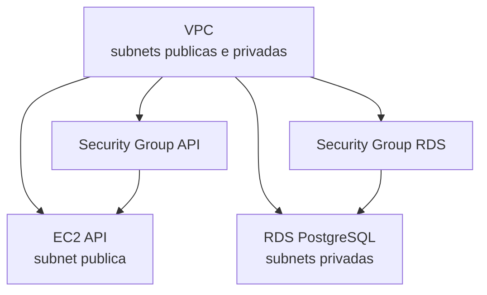

# TechNova Infrastructure Library

Biblioteca Terraform de infraestrutura reutilizavel para criar ambientes AWS padronizados. A entrega demonstra a mesma composicao de modulos em dois ambientes: `dev` e `staging`.

## Visao geral

Os modulos encapsulam os recursos de rede, seguranca, computacao e banco de dados. Cada ambiente apenas fornece valores e conecta os outputs de um modulo aos inputs do seguinte, reduzindo duplicacao e facilitando a evolucao da infraestrutura.

## Arquitetura



Os roots `environments/dev` e `environments/staging` usam os quatro modulos abaixo. A VPC cria a rede; os Security Groups usam o ID da VPC; a EC2 usa uma subnet publica e o SG da API; o RDS usa as subnets privadas e o SG do banco.

## Modulos disponiveis

### VPC

Cria VPC, Internet Gateway, subnets dinamicas com `for_each`, route table publica e associacoes.

| Input | Tipo | Obrigatorio | Descricao |
|---|---|---|---|
| `vpc_cidr` | string | Sim | CIDR da VPC |
| `project_name` | string | Sim | Nome do projeto |
| `environment` | string | Sim | Ambiente |
| `subnets` | map(object) | Sim | Mapa com `cidr`, `az` e `type` |

| Output | Descricao |
|---|---|
| `vpc_id` | ID da VPC |
| `public_subnet_ids` | IDs das subnets publicas |
| `private_subnet_ids` | IDs das subnets privadas |

Exemplo:

```hcl
module "vpc" {
  source       = "../../modules/vpc"
  vpc_cidr     = "10.0.0.0/16"
  project_name = "technova"
  environment  = "dev"
  subnets = {
    public-1 = { cidr = "10.0.1.0/24", az = "us-east-1a", type = "public" }
  }
}
```

### Security Group

Modulo generico para API, RDS, bastion ou outros componentes. Recebe uma lista de regras de ingress e sempre libera todo o trafego de saida.

| Input | Tipo | Obrigatorio | Descricao |
|---|---|---|---|
| `name` | string | Sim | Nome do Security Group |
| `vpc_id` | string | Sim | ID da VPC |
| `ingress_rules` | list(object) | Nao | Portas, protocolo, CIDRs e descricao |
| `environment` | string | Sim | Ambiente |
| `project_name` | string | Sim | Nome do projeto |

| Output | Descricao |
|---|---|
| `sg_id` | ID do Security Group |

### EC2

Cria uma instancia EC2 em uma subnet existente, com AMI, tipo, key pair, Security Groups e `user_data` configuraveis.

| Input | Tipo | Obrigatorio | Descricao |
|---|---|---|---|
| `instance_name` | string | Sim | Nome da instancia |
| `instance_type` | string | Nao | Tipo; default `t2.micro` |
| `ami_id` | string | Sim | ID da AMI |
| `subnet_id` | string | Sim | ID da subnet |
| `security_group_ids` | list(string) | Sim | IDs dos Security Groups |
| `key_name` | string | Sim | Key pair |
| `user_data` | string | Nao | Script de inicializacao |

| Output | Descricao |
|---|---|
| `instance_id` | ID da instancia |
| `public_ip` | IP publico |
| `private_ip` | IP privado |

### RDS

Cria um DB Subnet Group com subnets privadas e uma instancia PostgreSQL `db.t3.micro`, sem acesso publico e sem snapshot final, adequado para ambientes de desenvolvimento.

| Input | Tipo | Obrigatorio | Descricao |
|---|---|---|---|
| `db_name` | string | Sim | Nome do database |
| `db_username` | string | Sim | Usuario master |
| `db_password` | string | Sim | Senha master sensivel |
| `subnet_ids` | list(string) | Sim | Subnets privadas |
| `security_group_ids` | list(string) | Sim | Security Groups do RDS |
| `instance_class` | string | Nao | Classe; default `db.t3.micro` |
| `environment` | string | Sim | Ambiente |
| `project_name` | string | Sim | Nome do projeto |

| Output | Descricao |
|---|---|
| `db_endpoint` | Endpoint de conexao |
| `db_name` | Nome do database |
| `db_port` | Porta PostgreSQL |

## Ambientes

| Aspecto | Dev | Staging |
|---|---|---|
| VPC | `10.0.0.0/16` | `10.1.0.0/16` |
| Subnets publicas | `10.0.1.0/24`, `10.0.2.0/24` | `10.1.1.0/24`, `10.1.2.0/24` |
| Subnets privadas | `10.0.3.0/24`, `10.0.4.0/24` | `10.1.3.0/24`, `10.1.4.0/24` |
| EC2 | `t2.micro` | `t2.micro` |
| RDS | `db.t3.micro` | `db.t3.micro` |
| Database | `technova_dev` | `technova_staging` |
| Naming | `technova-dev-*` | `technova-staging-*` |

## Como usar

### Pre-requisitos

- Terraform 1.5 ou superior.
- AWS CLI configurada ou variaveis de ambiente de uma sessao AWS Academy.
- Permissoes para VPC, EC2, RDS e Security Groups.
- Key Pair criado na mesma regiao da infraestrutura.
- Uma AMI Linux valida para a regiao escolhida.

### Aplicar um ambiente

1. Entre na pasta do ambiente desejado.
2. Ajuste `terraform.tfvars`: especialmente `ami_id`, `key_name` e `db_password`.
3. Inicialize, valide e visualize o plano.

```bash
cd environments/dev
terraform init
terraform fmt -recursive
terraform validate
terraform plan
terraform apply
```

Para staging, use `cd environments/staging`. Cada pasta possui seu proprio state Terraform e pode ser gerenciada independentemente.

### Criar um novo ambiente

Copie uma das pastas existentes, altere as variaveis locais de `main.tf`, os CIDRs, o nome do ambiente e `terraform.tfvars`. Mantenha as chamadas para os quatro modulos e os encadeamentos entre outputs e inputs.

## Seguranca

Senhas reais devem ser fornecidas por variaveis de ambiente, um arquivo `.tfvars` fora do Git ou um backend de secrets. O `.gitignore` exclui state, credenciais AWS e arquivos de secrets. Nunca versione chaves temporarias ou senhas reais.
